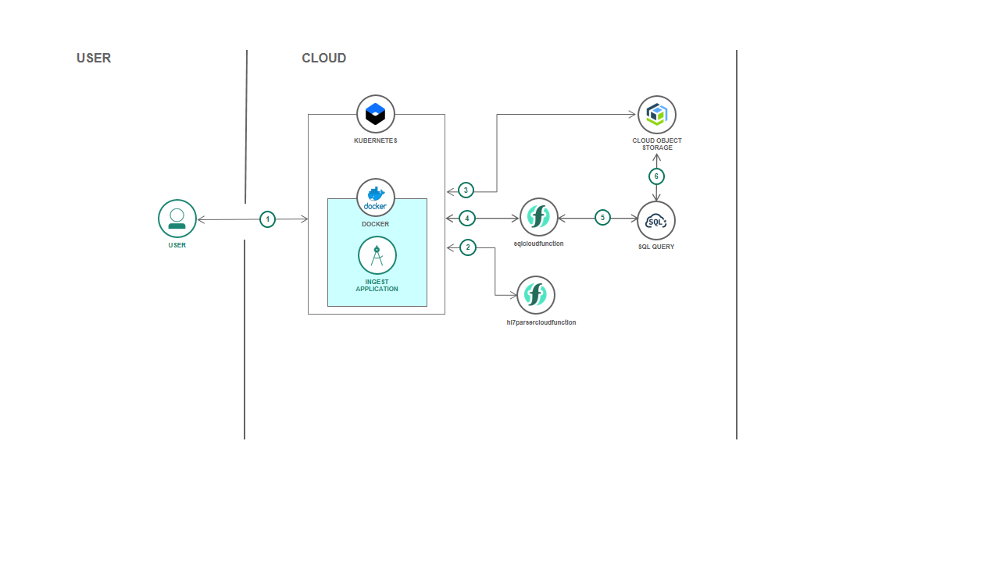
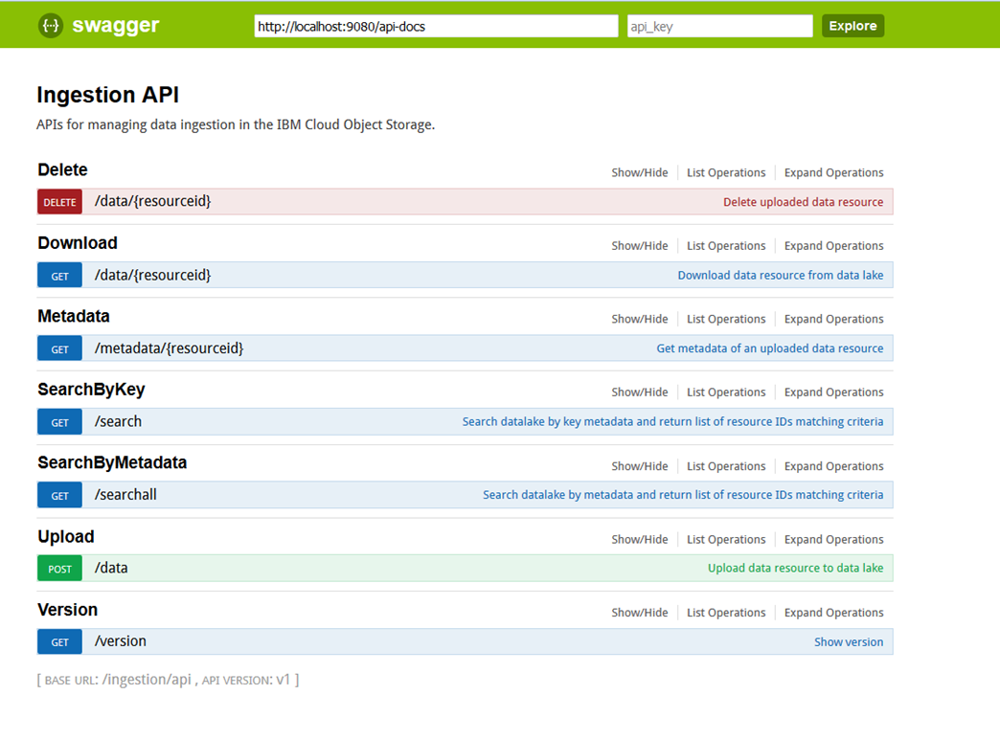

# REST Application to ingest and search documents on IBM Cloud Object Storage 

## Overview
REST APIs to ingest and retrieve stored documents in a simple Node.js application, the application uses the IBM Object Storage service available on IBM Cloud and is deployed on top of the container orchestration platform Kubernetes. Documents are parsed and validated using an external cloud function: hl7parsercloudfunction. Two types of searches are available, one by keys and one by metadata using the IBM SQL Query service.  


## Flow



1. The external application invokes INGESTION REST APIs 
2. In case of upload request the application invokes the hl7parser cloud function to validate and extract metadata from HL7 documents
3. The application access the Cloud Object Storage instance to store valid documents, get document metadata, content and search by key.  
4. To search by metadata the sqlcloud function is invoked.
5. The sqlcloudfunction runs sql statements using the SQL Query service.


## Preliminary Steps

### 1. Create and configure a Cloud Object Storage service instance
Sign up for an IBM Cloud account. Once registered, add an [IBM Cloud Object Storage service](https://console.bluemix.net/catalog/services/cloud-object-storage). 

In the IBM Cloud Object Storage UI:

- create two buckets (these are "folders" where uploaded files will be kept) one to store objects and another to store metadata as json file.
- create a set of credentials. 
Make a note of the bucket names, API endpoint and API key for the next step.

### 2. Create a SQL Query service instance

 Follow instructions to create an [SQLQuery instance](https://console.bluemix.net/docs/services/sql-query/getting-started.html#getting-started-tutorial)

### 3. Build and publish hl7parser cloud function
Follow instructions for [hl7-parser-cloud-function](https://github.com/AnnalisaChiacchi/hl7-parser-cloud-function)

### 4. Build and publish SQL cloud function
Follow instructions for [sqlcloudfunction](https://github.com/IBM-Cloud/sql-query-clients/tree/master/Python/cloud_function)
Make a note of the cloudfunction api host and namespace.


## Run the application locally

### 1. Clone the repo

Clone the repo locally. In a terminal, run:

```
$ git clone https://github.com/carolagirolami/IBMCOS-ingestion-api.git
```

### 2. Run the application
1. Install [Node.js](https://nodejs.org/en/)
2. Run the following commands in a terminal: 

```
$ npm install
$ npm run start
```

Verify app is running and working correctly.


## Run the application using Docker

### Prerequisites:
1. [Create Docker account](https://cloud.docker.com/)
 
2. [Install Docker CLI](https://docs.docker.com/install/)

3. [Retrieve and save your Docker user id](https://cloud.docker.com/)

### 1. Build the image

In a terminal, run:

```
$ docker build -t $docker_username/IBMCOS-ingestion-api .
```

Your image should be listed by running:

```
$ docker images
```

### 2. Run the image

In a terminal, run:

```
$ docker run -p 3000:3000 -d $docker_username/IBMCOS-ingestion-api
```

You can now access the application at http://localhost:3000


## Run the application on Kubernetes

### Prerequisites
1. [Create an account with IBM Cloud](https://console.bluemix.net/registration/)

2. [Install IBM Cloud CLI](https://console.bluemix.net/docs/cli/reference/bluemix_cli/get_started.html#getting-started)

3. Log into your IBM Cloud account

```
$ bx login 
```

If you have a federated ID, use bx login --sso to log in to the IBM Cloud CLI.

4. Install the Container Registry plug-in.

```
$ bx plugin install container-registry -r Bluemix
```

5. Install the Container Service plug-in.

```
$ bx plugin install IBM-Containers -r Bluemix
```

6. [Install kubectl](https://kubernetes.io/docs/tasks/tools/install-kubectl/#install-kubectl)

7. Create cluster

```
$ bx cs cluster-create --name YOUR_CLUSTER_NAME
```

8. Configure Kubernetes cluster

```
$ bx cs cluster-config YOUR_CLUSTER_NAME
```

Copy and paste response in CLI

9. Choose a name for your first namespace, and create that namespace. Use this namespace for the rest of the Quick Start.

```
$ bx cr namespace-add YOUR_NAMESPACE
```


### 1. Build image

Build image in the IBM Container Registry: 

```
$ bx cr build -t registry.<ibm_cloud_region>.bluemix.net/<your_namespace>/IBMCOS-ingestion-api .
```

### 2. Deploy and run the application on Kubernetes with a yaml file

- Create a built-in secret to store APIKEY and SERVICE_INSTANCE_ID obtained at point 1. Create and configure an Cloud Object Storage service instance. 

```
  $ kubectl create secret generic apikey --from-literal=DEFAULT_API_KEY="XXXXXXX" --from-literal=DEFAULT_SERVICE_INSTANCE_ID="crn:v1:bluemix:public:cloud-object-storage:global:a/xxxxxx"
```

- Edit the file deploy/ingestion-api-deployment.yml setting the following variables on the base of the value 
obtained at point 1. Create and configure an Cloud Object Storage service instance.  and point  4. Build and publish SQL cloud function

```
    - name: DEFAULT_IAM_ENDPOINT 
      value: <iam endpoint>
    - name: DEFAULT_ENDPOINT_URL 
      value: <endpoint_url>
    - name : DEFAULT_CLOUDFUNCTION_API_HOST
      value: <cloudfunction_api_host>
    - name: DEFAULT_CLOUDFUNCTION_NAMESPACE
      value: <cloudfunction_namespace>
    - name: DEFAULT_OBJECTBUCKET
      value: <object_bucket_name>  
    - name: DEFAULT_METADATABUCKET
      value: <metadata_bucket_name>  
```
- Run:

```
    $ kubectl create -f deploy/ingestion-api-deployment.yml
```

### 3. Expose the app to the web by setting the port with the yaml file

```
$ kubectl create -f service/ingestion-api-service.yml
```

To access your application. You would need the public IP address of your cluster and NodePort of the service.

```
# For clusters provisioned with IBM Cloud
$ bx cs workers YOUR_CLUSTER_NAME

# For details on a specific Kubernetes service
$ kubectl describe service deploy-react-kubernetes-service
```

Swagger-ui is available on http://IP_ADDRESS:NODE_PORT/docs



# License

[Apache 2.0](LICENSE)